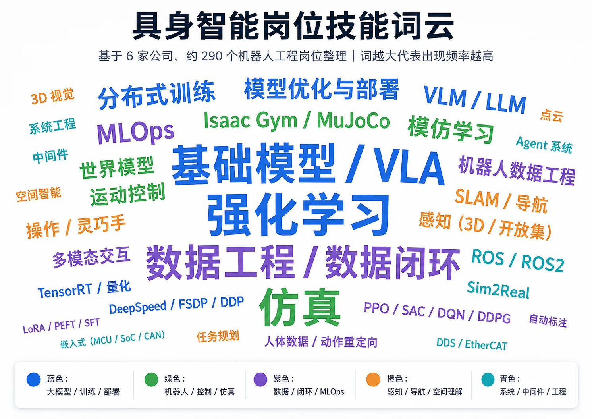

<div align="center">
    
</div>

<h1 align="center">Dive into Embodied AI</h1>
<p align="center"><b>具身智能入门与求职开源教程</b></p>

<p align="center">
  <a href="https://datawhalechina.github.io/dive-into-embodied-ai/"></a>
  <a href="http://creativecommons.org/licenses/by-nc-sa/4.0/"></a>
  
</p>

> [!CAUTION]
> **Alpha 内测版本**:仍在迁移和重构中,部分章节是占位页,欢迎提 Issue 反馈问题或建议。

## 项目定位

从零到一搭建一台具身智能机器人：深入强化学习、World-Model、VLA 等智能决策方法的工程落地，贯穿仿真环境、控制器、运动规划、感知系统等技能树模块,并在真实项目中跑通"决策—控制—感知"完整链路。

## 内容大纲

教程分为「零基础入门 + 项目实战 + 求职面试 + 理论技能树」四个阶段。章节名后的链接直接指向当前文档或对应目录。

状态标记说明:**✅ 可用** = 章节内容完整,可直接阅读;**🚧 部分可用** = 一部分章节有内容、一部分仍是占位;**🚧 占位中** = 目录已建但只有占位页;**⏳ 待补充** = 暂未开工。

### 零基础入门

零基础入门只保留两个入口:先看路径,再用一个完整项目建立整体感。

| 章节 | 简介 | 状态 |
| :--- | :--- | :--- |
| [学习路径](docs/overview/learning-path.md) | 从零基础到项目和求职的主线安排 | ✅ 可用 |
| [从0到1搭建四足机器人](docs/practices/quadruped/cs123/0.intro.md) | 从一个完整仿真项目入手理解具身智能系统 | ✅ 可用 |

### 项目实战

| 章节 | 简介 | 状态 |
| :--- | :--- | :--- |
| [机械臂](docs/practices/robot-arm/placeholder.md) | MuJoCo 抓放、DDPG、LeRobot 数据采集已可用;ROS2 控制、模仿学习、VLA 控制占位中 | 🚧 部分可用 |
| [四足机器人](docs/practices/quadruped/placeholder.md) | CS123 课程复刻 8 章可用;sim2sim、sim2real 指南占位中 | 🚧 部分可用 |
| [双足 / 人形](docs/practices/humanoid/placeholder.md) | 平衡控制、动作跟踪、任务规划 Demo | 🚧 占位中 |
| [移动操作](docs/practices/mobile-manipulation/) | 导航基础、视觉语言导航、移动操作 Demo | 🚧 占位中 |
| [轮足机器人](docs/practices/wheel-legged/flamingo-isaaclab/preview.md) | Flamingo 两轮足 · Isaac Lab 训练 + PPO / CaT 对比 + 跨仿真验证(规划中) | 🔜 预告 |

<table align="center">
  <tr>
    <td align="center" width="50%">
      <a href="docs/practices/quadruped/cs123/0.intro.md">
        
      </a>
      <br/><sub>✅ <b><a href="docs/practices/quadruped/cs123/0.intro.md">从 0 到 1 搭建四足机器人</a></b><br/>CS123 仿真版 · MuJoCo + PPO + LLM 控制</sub>
    </td>
    <td align="center" width="50%">
      <a href="docs/practices/wheel-legged/flamingo-isaaclab/preview.md">
        
      </a>
      <br/><sub>🔜 <b><a href="docs/practices/wheel-legged/flamingo-isaaclab/preview.md">两轮足 Flamingo · Isaac Lab</a></b><br/>新章预告 · Isaac Lab + PPO / CaT 训练</sub>
    </td>
  </tr>
</table>

### 求职面试

| 章节 | 简介 | 状态 |
| :--- | :--- | :--- |
| [岗位技能拆解](docs/career/job-skill-map/) | 强化学习、VLA 等方向的技能点拆解 | 🚧 占位中 |
| [面经与八股](docs/career/interview-questions/) | 具身方向常见面试题与高频八股 | 🚧 占位中 |
| [招聘信息](docs/career/job-listings/) | Top 具身公司在招岗位汇总 | 🚧 占位中 |

### 理论技能树

理论技能树按当前导航的四列组织:大脑、小脑、感知系统、工程底座。当前优先把已有内容并入技能树,空缺模块先保留占位。

#### 大脑：智能决策

| 章节 | 简介 | 状态 |
| :--- | :--- | :--- |
| [强化学习决策](docs/foundations/rl-for-robotics/1.intro.md) | MDP、DQN、PPO、SAC、DDPG/TD3 与模仿学习 | ✅ 可用 |
| [视觉-语言-动作大模型(VLA)](docs/foundations/vla/vla-intro.md) | RT-1/RT-2、OpenVLA、ACT、Diffusion Policy、π 系列 | ✅ 可用 |
| [World-Model](docs/foundations/world-model/placeholder.md) | 世界模型在具身场景下的落地路径 | 🚧 占位中 |

#### 小脑：运动控制

| 章节 | 简介 | 状态 |
| :--- | :--- | :--- |
| [强化学习控制](docs/foundations/rl-for-robotics/10.ppo.md) | 把策略学习接到连续控制和机器人任务上 | ✅ 可用 |
| [控制器](docs/foundations/controllers/intro.md) | PID、LQR、MPC、阻抗控制与系统集成教程 | ✅ 可用 |
| [运动规划](docs/foundations/robotics-and-ros2/10.moveit2_basics.md) | Motion Planning 与 MoveIt 2 规划闭环 | ✅ 可用 |

#### 感官：感知系统

本体感知：机器人必须知道自己在哪里、姿态如何、速度如何、是否失稳。

外部感知：相机、雷达、触觉、电机电流、IMU、足端接触、机身姿态、末端位置。

| 章节 | 简介 | 状态 |
| :--- | :--- | :--- |
| [视觉感知与 VLM](docs/foundations/vlm/0.intro.md) | Transformer、ViT、视觉编码器与多模态融合 | ✅ 可用 |
| [定位与触觉感知](docs/foundations/perception/placeholder.md) | SLAM、足端接触、触觉传感和多传感器融合 | 🚧 占位中 |

#### 工程底座

| 章节 | 简介 | 状态 |
| :--- | :--- | :--- |
| [仿真工具](docs/foundations/simulation/1.intro.md) | Isaac Sim、MuJoCo、Gymnasium、PyBullet 快速上手 | ✅ 可用 |
| [ROS2](docs/foundations/robotics-and-ros2/0.intro.md) | 坐标变换、FK/IK、tf2、URDF 与 MoveIt 2 | ✅ 可用 |
| [CAN 与 MCU 通信](docs/foundations/communication/can-mcu.md) | 底层通信、执行器协议和上下位机链路 | 🚧 占位中 |
| [机械结构](docs/foundations/hardware/placeholder.md) | 连杆、关节、电机、减速器和末端执行器 | 🚧 占位中 |
| [数据工程与模仿学习](docs/foundations/rl-for-robotics/12.imitation-learning.md) | 从遥操作数据到模仿学习、LeRobot 工具链和策略训练 | ✅ 可用 |

## 组队学习

Datawhale 会围绕本教程组织组队学习。历史与在筹备中的组队学习计划文档会集中放在 `docs/team-learning/`(施工中),包括每期的学习路线、打卡要求和对应章节的导读。

- 最新一期报名入口:施工中
- 往期学习资料归档:施工中

## 本地预览

仓库使用 **Git LFS** 存放视频和 GIF。clone 之后必须先装 `git-lfs` 再 `git lfs pull`,否则本地看到的图/视频是 pointer 文本而不是真内容。完整步骤见 [CONTRIBUTING.md](CONTRIBUTING.md#首次克隆必读)。

```bash
# 1. 装 git-lfs(每台机器只需一次)
# brew install git-lfs        # macOS
# sudo apt install git-lfs    # Ubuntu / Debian
# choco install git-lfs       # Windows

# 2. 初始化并拉取 LFS 文件
git lfs install
git lfs pull

# 3. 装依赖、起本地预览
npm install
npm run dev
```

## 贡献者名单

| 姓名 | 职责 | 简介 |
| :--- | :--- | :--- |
| 罗如意 | 项目负责人 | 智能汽车竞赛国奖&多模态顶会Oral&FunRec开源项目负责人 |
| 江季  | 项目负责人 | [蘑菇书](https://github.com/datawhalechina/easy-rl)作者 |
| 康博 | 项目负责人 | nobl.ai 联合创始人 & 比利时根特大学访问教授|

## 关注我们

<div align=center>
<p>扫描下方二维码关注公众号:Datawhale</p>

</div>

## LICENSE

<a rel="license" href="http://creativecommons.org/licenses/by-nc-sa/4.0/"></a><br />本作品采用<a rel="license" href="http://creativecommons.org/licenses/by-nc-sa/4.0/">知识共享署名-非商业性使用-相同方式共享 4.0 国际许可协议</a>进行许可。
