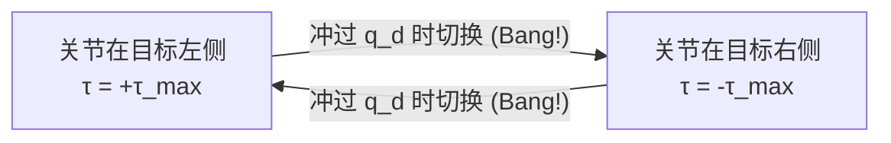

import Figure from '@site/src/components/Figure';

# 1. 执行器与 PID 控制

## 本章目标

- 理解位置误差、速度误差、P 增益、D 增益各自在干什么
- 能在 MuJoCo 里把一个 hinge 关节从任意初始角度稳定控制到目标角度
- 能画出一张关节角随时间的响应曲线，并解释过冲 / 欠阻尼 / 稳态误差
- 知道为什么工业上几乎所有执行器最低层都是 PD / PID

## 前置阅读

- [仿真与可视化 · MuJoCo 快速上手](/docs/foundations/simulation/mujoco)
- 想更直观理解，可以先看本章的欠阻尼 / 临界阻尼 / 过阻尼曲线；交互模式施工中，后续补上。

## 章节大纲

1. 执行器分类与控制侧关键指标：电动 / 液压 / 气动，准直驱 vs 谐波减速器，反射惯量与控制带宽
2. 齿轮箱：减速比如何改写"力矩 / 速度 / 惯量"这组二阶系统参数
3. 仿真到真机的四类差异：反射惯量、力矩饱和、传动间隙、控制延迟
4. 反馈控制：开环 vs 闭环回路，为什么机器人关节几乎只用闭环
5. Bang-Bang 控制：极限环、死区，及它在空调 / 电热水器场景下的合理性
6. PID 三项的物理意义：现在（P） / 过去（I） / 未来（D）
7. 为什么工程上几乎只留 PD：积分饱和、虚拟弹簧-阻尼器、重力前馈替代 I
8. PD 的二阶系统视角：$\omega_n$、$\zeta$ 与 $K_d = 2\zeta\sqrt{K_p I}$ 这套调参骨架
9. 在 MuJoCo 里实现 PD：`position` 内置写法 vs `motor` 手搓 PD
10. 实验 1：三组 $K_p / K_d$ 下的响应曲线（欠 / 临界 / 过阻尼）
11. 实验 2：加恒定外扰，看 PD 为什么吃不掉稳态误差

## 1.1 执行器

**执行器(Actuator)** 是机器人技术中的核心组件，可以被直观地理解为系统的“肌肉”。它的核心作用是将某种形式的能量（电力、液压、气压等）转化为物理运动，从而改变受控对象的状态（例如让机器人能够行走、抓取等）。

### 1.1.1 工作原理

执行器的基本原理是把弱电指令放大成机械动作，再通过传感器把实际状态回传给控制器。可以拆成四步：

1. **输入信号**：上层控制器（PC、嵌入式 MCU 或专用驱动板）按固定频率把目标值（位置、速度或力矩）发给执行器，常见承载是 PWM、CAN、EtherCAT 等不同协议。
2. **能量转换**：执行器内部机构把输入信号放大并转换成另一种能量形式——电动机把电流经磁场转成转矩，液压缸把油压转成推力，气动肌肉把气压转成收缩力。
3. **产生动作**：输出端体现为位移、转角、推力或扭矩，直接作用在关节、轮子或末端执行器上。
4. **反馈回路**：现代执行器几乎都内嵌编码器、电流传感器或力矩传感器，把实际状态回传给控制器，便于构成反馈回路。

{/* TODO: actuator-workflow 图待补充 */}

### 1.1.2 执行器分类

按能量来源，常见执行器可以分成三大类：

| 类别 | 代表 | 典型场景 | 特点 |
|---|---|---|---|
| 电动 | 有刷直流、**无刷直流(BLDC)**、步进 | 机械臂、足式机器人、无人机 | 控制精度高、响应快，具身智能场景里的绝对主流 |
| 液压 | Boston Dynamics Atlas(老款) | 重载、高爆发 | 功率密度最高，但贵、漏油、噪声大 |
| 气动 | 软体抓手、McKibben 人工肌肉 | 柔性操作、仿生 | 轻、便宜、本征柔顺，但控制精度差 |

<Figure src={require('./figs/electric-actuators.webp').default} caption="常见电动执行器示意图" />

电动执行器是目前机器人（尤其是消费级、协作级和大多数工业机器人）中最常见的执行器类型，其中又分出两条明显的路线，对之后调 PID 的影响完全不同：

- **高减速比 + 小电机**：谐波减速器 + 伺服电机，典型是 UR、Franka 这类协作机械臂。刚性好、精度高，但几乎不可反向驱动(back-drivable 近乎为零)，你用手推不动它的关节。
- **低减速比 + 大电机(准直驱，Quasi-Direct Drive，QDD)**：MIT Mini Cheetah、Unitree A1/Go2 走的路线。减速比通常只有 6:1 ~ 10:1，电机本体扭矩做得很大，好处是**能反向驱动、能靠电流估力矩、落地冲击不容易打坏齿轮**。足式机器人基本都选这条路。


### 1.1.3 关键指标

执行器的指标能列十几项，但**没有一组通用的"最重要的几项"——优先级是被场景决定的**。同一款减速器，挂在工业机械臂上是首选，挪到人形机器人上几乎一项也对不上号。所以在背指标之前，先弄清楚自己在做哪一类机器人，比逐项对照定义实用得多。

下面是机器人语境里最常被提到的几项：

| 指标 | 符号 / 单位 | 一句话 |
|---|---|---|
| 扭矩 / 力 | $\tau_{rated}, \tau_{peak}$ (N·m) | 持续与瞬时能输出的力，决定能扛多重 |
| 速度 | $\omega$ (rad/s, RPM) | 关节最高能转多快 |
| 重复定位精度 | Repeatability (mm, °) | 多次到同一目标点的偏差有多大 |
| 反向可驱动性 | back-drivability | 外力能否推着关节倒转，力控与人机交互的基础 |
| 力矩密度 | N·m / kg | 单位重量能塞进的扭矩，轻量化能力 |
| 控制带宽 | Hz | 控制回路最高能跟踪多快的目标变化 |
| 扭转刚度 | N·m / rad | 输出端被外力偏转一弧度需多大力矩，越大越"硬" |
| 反射惯量 | $N^2 I_{motor}$ (kg·m²) | 减速比 $N$ 把电机转子惯量放大到关节端的等效值 |

若只看这张表会觉得每项都重要，但落到具体机器人会发现——真正反复在意的只有其中两三项，而且**优先级会发生明显翻转**：

| 场景 | 代表平台 | 真正最在意 | 为什么 |
|---|---|---|---|
| 工业机械臂 | ABB IRB / FANUC | 重复定位精度、扭转刚度、寿命 | 焊接 / 装配是把同一个动作重复几百万次，毫米级偏差直接报废工件；闭环带宽其实只有几十 Hz |
| 协作机械臂 | UR / Franka | 反向可驱动性、力矩控制精度 | 要和人共处，撞到人时必须能被推开，并能感知接触力 |
| 足式 / 人形 | Unitree Go2 / G1, Atlas | 功率密度、控制带宽、反向可驱动性 | 全身几十个关节要塞进有限体重，落地冲击和平衡需要 500 ~ 1000 Hz 的控制环 |

最直观的对比是工业机械臂和人形机器人：前者愿意为精度牺牲反向驱动性（用谐波减速器，几乎推不动），后者反过来愿意为反向驱动性牺牲精度（QDD 路线，定位精度比工业臂差一两个数量级）。**没有"更好的执行器"，只有"更适合任务的执行器"**。

本章后续走的是机器人 / 足式视角，所以你会反复在 PD 公式里看到 **反射惯量**、**力矩-转速曲线**、**控制带宽** 这三项；它们也是最容易在仿真和真机之间对不上号的几项——下一小节会专门拆开看。

### 1.1.4 齿轮箱

齿轮箱（Gearbox），在机器人和机械工程领域通常被称为减速器（Reducer）或传动装置，你可以把它直观地理解为机器人的**“变速自行车齿轮系统”**。

它的核心功能是：连接在动力源（如电机）和执行端（如机械臂关节、车轮）之间，通过内部不同大小齿轮的物理啮合，来改变旋转的“速度”和“扭力（扭矩）”。

机器人之所以几乎离不开它，是因为 BLDC 等常见电机"转得快、力矩小"(几千 RPM、零点几 N·m)，而关节需要的是"慢而有力"(十几 rad/s、几 N·m 到几十 N·m)，中间必须经过一级换算：

$$
\begin{equation}\label{eq:gear_ratio}
\tau_{out} = N\,\eta\,\tau_{motor},\qquad \omega_{out} = \frac{\omega_{motor}}{N},\qquad I_{reflected} = N^2\,I_{motor}
\end{equation}
$$

<Figure
  src={require('./figs/gear-ratio-demo.gif').default}
  caption="齿轮传动动画：主动轮与从动轮按固定传动比反向旋转，输出端转得更慢但更有力"
  width={640}
/>

一套减速比为 $N$ 的齿轮箱同时做三件事：

- 力矩放大 $N$ 倍
- 转速缩小 $N$ 倍
- **电机转子惯量在关节端被放大 $N^2$ 倍**(最常被忽略，却直接影响 PD 调参和冲击时的受力)

**衡量一个齿轮箱时最常关注的几项参数**：

| 参数 | 典型单位 | 说明 |
|---|---|---|
| 减速比 $N$ | — | 输入转速与输出转速之比，决定力矩 / 速度 / 反射惯量的放大倍数 |
| 额定 / 峰值输出扭矩 | N·m | 输出端的可持续与瞬时承载，超过峰值可能打齿甚至损坏 |
| 传动效率 $\eta$ | % | 输出功率 / 输入功率，行星约 90%、谐波约 70 ~ 80%、摆线约 85 ~ 90% |
| 回程间隙(backlash) | 弧分(arcmin) | 反向运动时的空程，直接决定定位精度与力控质量 |
| 扭转刚度 | N·m / rad | 输出端到达目标位置后，被外力偏转的角度——越大越"硬" |
| 噪声 / 寿命 | dB / 小时 | 协作场景与长期运行中容易被忽视的隐性门槛 |

换算到 PD 调参的语言，可以记住三条结论：

- **$N$ 越大，关节越"重"**：反射惯量按 $N^2$ 放大，对应的固有频率 $\omega_n=\sqrt{K_p/I}$ 更低，相同 $K_p$ 下响应更慢。
- **$N$ 越大，反向可驱动性越差**：摩擦力矩也被放大，外力几乎推不动电机端，这是协作臂用谐波减速器的直接代价。
- **回程间隙和扭转刚度决定位置精度的上限**：即便 PD 参数调得再准，齿轮箱自身的空程和柔性也会把最小可达误差钉死在某一档。

机器人上最常见的三类齿轮箱：

| 类型 | 典型减速比 | 回程间隙(backlash) | 常见场景 |
|---|---|---|---|
| 行星齿轮(Planetary) | 3:1 ~ 100:1 | 有(几弧分到几十弧分) | 足式 QDD、低成本机械臂 |
| 谐波减速器(Harmonic Drive) | 30:1 ~ 160:1 | 近似为零 | 协作机械臂、精密装配 |
| 摆线针轮(Cycloidal / RV) | 30:1 ~ 260:1 | 很小 | 工业六轴基座、重载关节 |

三者的取舍大致可以浓缩成：

- **要便宜、要反向可驱动、能接受一点抖动** → 低减速比行星齿轮 + 大电机(QDD 路线，Mini Cheetah / Unitree)
- **要高精度、不在乎反向驱动** → 谐波减速器(UR / Franka 路线)
- **要扛大负载、要刚性** → 摆线针轮(ABB / FANUC 这类工业机械臂基座)

就本章而言，记住一条就够：**齿轮箱以不同比例改写了"力矩 / 速度 / 惯量"这三个量，PD 真正控的是改写之后的那个二阶系统**。后面在 MuJoCo 里调 $K_p, K_d$ 时，如果 sim-to-real 对不上，先别怀疑公式——先去核对减速比和电机参数。

### 1.1.5 仿真到真机的差异


具身智能项目里"仿真可运行、真机无法稳定"的故障，绝大多数都不是公式或数值标错，而是**仿真器默认把几个真实世界的非理想因素当成零**。下面四项是 PD 调参时反复会撞到的坑：

| Gap | 仿真里默认 | 真机会怎么偏 / 仿真里怎么补 |
|---|---|---|
| **反射惯量** | URDF / MJCF 只填连杆惯量，电机转子惯量常被忽略 | 关节比真机偏轻，$\omega_n=\sqrt{K_p/I}$ 估高，搬到真机立即高频振荡。MuJoCo 用 `armature` 字段补 |
| **力矩饱和** | `ctrlrange` 是干净的硬截断 | 真机叠加热限制、电流环响应、反电动势，力矩-转速曲线非矩形。仿真里给峰值留一档余量 |
| **传动间隙 / 摩擦** | 默认无回程间隙，粘滞 / 库仑摩擦不自动建模 | 低速过零、方向反转时出现顿挫，仿真临界阻尼到真机变微振。MJCF 用 `frictionloss` 显式叠 |
| **控制延迟** | 读编码器 → 计算 PD → 发驱动 当作 0 ms | 真机一拍 1 ~ 5 ms，分布式总线更大，削弱 $K_d$ 的阻尼贡献，仿真临界阻尼到真机变欠阻尼 |

四项叠加之后的实操结论是一条经验规则：**仿真中宁可保守一档**，给上面这四项留出余量。迁移到真机时通常先下调 $K_p$、再谨慎增加 $K_d$，而不是反过来。


## 1.2 反馈控制

执行器把指令变成动作，那么指令本身怎么得到？常见的两条思路是**开环**与**闭环**，区别在于控制器是否读取被控对象的实时状态。

### 1.2.1 开环控制

**开环控制(Open-loop Control)** 的控制量只依赖目标 $q_d$ 和时间 $t$，不读取系统当前状态 $q$：

$$
\begin{equation}\label{eq:open_loop}
u(t) = f(q_d, t)
\end{equation}
$$

家用洗衣机、微波炉、按预设脉冲数旋转的步进电机都是典型代表——指令序列在程序里写死，执行端实际走到哪里不会反过来影响后续动作。

{/* TODO: open-loop-control 图待补充 */}

开环控制的优点是**简单**，不需要传感器建立反馈通路。但缺点是**无法适应任何外界扰动**，例如机械臂收到"转到 90°"的开环指令，一旦碰到摩擦、负载或障碍物，就会停在偏离 90° 的位置，并且不会自我修正。

### 1.2.2 闭环控制

**闭环控制(Closed-loop Control)** 又称**反馈控制(Feedback Control)**，控制量根据实测误差 $e = q_d - q$ 实时计算：

$$
\begin{equation}\label{eq:closed_loop}
u(t) = g\bigl(e(t)\bigr)
\end{equation}
$$

每个采样周期，传感器测出当前 $q$，控制器算出 $e$ 并输出 $u$，执行器把 $u$ 作用到被控对象上，下一拍传感器再测一次状态——**控制器 → 执行器 → 被控对象 → 传感器 → 控制器** 由此闭合成回路。

{/* TODO: closed-loop-control 图待补充 */}

闭环的关键能力是**自我纠错**：扰动来自哪里并不重要——多挂了 1 kg 负载、电池电压跌了、桌面把关节顶了一下，只要它表现为偏离目标的 $e \ne 0$，控制器在下一拍就能感知并修正。

后续讨论的 Bang-Bang 和 PID 控制，差别都在 $g(\cdot)$ 这一步具体怎么算。

## 1.3 Bang-Bang 控制

1.2.2 节最后说，闭环控制之间的差别都集中在 $g(\cdot)$ 怎么算这一步上。**Bang-Bang 控制**（又称双位控制或开关控制）把这个 $g$ 简化到了极致——只看误差的方向，不看大小：

$$
\begin{equation}\label{eq:bang_bang}
\tau(t) = \tau_{max}\,\mathrm{sign}\bigl(e(t)\bigr),\qquad e(t) = q_d - q(t)
\end{equation}
$$

关节在目标左侧就全力右拉，在目标右侧就全力左拉，中间没有"拉多大"的档位。类比开车，油门和刹车各有一个踏板——要么踩到底，要么完全松开。每当系统穿越目标点，执行器在极短时间里从 $+\tau_{max}$ 切换到 $-\tau_{max}$，机械结构上常伴随一声清脆的换向冲击声（Bang!），名字也由此而来。

听上去很粗暴，但只要被控对象足够"慢"，Bang-Bang 就是最便宜也最可靠的解。家用空调是最直观的例子：室温低于设定 → 开压缩机 → 升温到设定上方一两度 → 关压缩机 → 自然耗散 → 跌回设定下方 → 再开。整个循环以分钟为单位，开 / 关切换瞬间的小幅温度波动你完全察觉不到，反而省掉了"开一半压缩机"这种不存在的硬件。同类的逻辑还覆盖了一批日常与工业场景：

| 场景 | 执行器 | 为什么合适 |
|---|---|---|
| 家用空调 / 暖气 | 压缩机开 / 关 | 温度变化以分钟计，压缩机无法"开一半" |
| 电热水器 | 加热管通 / 断 | 加热本身是积分型过程，对开关时刻不敏感 |
| 卫星姿态冷气推进 | 喷气阀开 / 关 | 推进器没有连续调节能力 |

可以把这些场景里 Bang-Bang 之所以合理的共同前提浓缩成一句话：**当被控对象的响应时间远大于切换抖动的时间，Bang-Bang 就是最优解**——空调升温要分钟，压缩机切换要毫秒，两者差几个数量级，循环里那点抖动被热惯性平滑掉了。

机器人关节不一样。一个轻量化关节的机械时间常数往往只有几十毫秒，电机扭矩切换却几乎是瞬间，两个时间尺度倒了过来。这时再用 Bang-Bang，关节会陷入下面这个无穷循环：



每一次穿越目标点都是一次 Bang，每一次 Bang 都因惯性冲过头，于是关节在目标附近永久震荡，静不下来。在相平面 $(q,\dot q)$ 上，这条循环表现为一条围绕原点的闭合曲线——数学上称为**极限环（Limit Cycle）**。它不是"还没收敛"，而是理论上永远不会收敛。

除了静不下来，连续的高频换向还带来两个副作用：电流在 $\pm\tau_{max}$ 之间反复切，对驱动器的 H 桥、齿轮箱的换向齿面都是直接冲击，寿命会被啃掉一截；同时不管误差是 5° 还是 0.01°，输出都是全功率，没有节能余地。

把 Bang-Bang 从关节里救出来只有两条思路：要么在目标附近开一个宽度为 $2\varepsilon$ 的**死区**（Deadband），误差一旦落进去就断电，可以把极限环压到几乎不动，代价是牺牲 $\varepsilon$ 以内的定位精度；要么干脆放弃"二选一"，让输出与误差成比例——离得越近出力越小。后一条路就是下一节的**比例控制（P）**。反过来看，Bang-Bang 恰好是 $K_p \to \infty$ 再被力矩饱和硬切到 $\pm\tau_{max}$ 之后的 P 控制极限退化形式。


## 1.4 PID 控制

PID 控制器(Proportional-Integral-Derivative Controller)是工程和自动化领域最经典、应用最广泛的反馈控制算法。具身智能和机器人仿真里，无论是让机械臂关节准确到达并保持某个角度，还是让无人机悬停在指定高度，底层几乎都会用到它——核心思想是根据当前误差、过去的误差累积以及误差的变化趋势，计算出一个控制量，驱动系统靠近目标。

具体到**为什么需要三项**，可以接着 1.3 节的逻辑往下推：Bang-Bang 在目标附近形成极限环，根本原因是输出只有 $\pm\tau_{max}$ 两档、没有"离得近就少出力"的余地。把开关替换成**正比于误差的连续输出**，极限环就消失了，这就是 P；但 P 单独工作时还会留下两个新问题——**残留稳态误差**(目标附近误差太小，P 出的力抵消不了重力或摩擦) 与 **快速逼近时的过冲**(惯性带着系统冲过头)。前者需要把过去的误差累积起来、推动系统补足那一截偏差，这是 I；后者需要预判误差的变化方向、在冲过头之前提前反向出力，这是 D。三项合起来就是 PID，正好对应时间的三个维度——现在、过去、未来。

下面用一个无人机悬停的例子把这三项一个个拆开看：

**1. 比例(Proportional， P) —— "着眼现在"**

比例项直接与当前误差成正比，误差越大，输出的控制力就越大。

- **直观感受**：目标高度 10 米、无人机当前在 2 米时，差距 8 米，P 控制会输出一个很大的上升油门;随着越来越接近 10 米，误差减小，油门也随之减小。
- **问题**：仅靠 P 很难正好到达目标。当无人机非常接近 10 米时，误差已经很小，P 给出的上升力可能刚好等于重力，结果无人机会稳定悬停在 9.5 米左右，永远差一截——这就是**稳态误差**(Steady-state error)。

**2. 积分(Integral， I) —— "回顾过去"**

积分项会随时间不断累积过去的误差。

- **直观感受**：如果无人机一直卡在 9.5 米，虽然每一瞬间的误差只有 0.5 米，但随着时间推移，积分项会把这 0.5 米不断叠加，累积出越来越大的控制力，最终推着无人机克服残余的重力/阻力，精确到达 10 米。
- **作用**：消除稳态误差。

**3. 微分(Derivative， D) —— "预测未来"**

微分项关注的是误差的变化率(斜率)，相当于一个阻尼器，用来预测系统的未来走向。

- **直观感受**：当无人机在 P 与 I 的作用下快速冲向 10 米时，惯性很容易让它冲过头——飞到 11 米再掉下来，形成剧烈的振荡(过冲，Overshoot)。D 控制会察觉到误差正在快速缩小，提前"踩刹车"，产生一个反向的阻力，让无人机平稳停在 10 米。
- **作用**：减少振荡、提高系统稳定性。

三项合起来，标准的 PID 表达式非常优美，把"过去、现在、未来"三个时间维度统一在了一起：

$$
\begin{equation}\label{eq:pid}
\tau(t) = K_p\,e(t) + K_i\int_0^t e(s)\,ds + K_d\,\dot e(t),\qquad e(t) = q_d(t) - q(t)
\end{equation}
$$


## 1.5 PD 控制

在工业与机器人控制里，**真正启用积分项的场景其实并不多**，绝大多数伺服回路最终留下的都是 PD。原因可以归纳成三条：

**1. 积分饱和(Integral Windup)在物理世界里会带来灾难性后果**

纯数学模型里积分项可以正常工作，但物理世界里执行器的输出力矩是有限的，且环境中到处是障碍物。设想一个关节目标角度是 90°，在 45° 时被桌面卡住：

- 使用 **PD** 时，关节会保持一个恒定推力(P 项相当于一根被拉伸的弹簧)，安全地顶住障碍物。
- 使用 **PID** 时，只要误差一直存在，积分项就会持续累加，电机收到越来越大的力矩指令，直到硬件上限。一旦障碍物突然移开，累积的积分项瞬间释放，关节会以非常剧烈的姿态甩出去——既容易损坏机器人，也带来明显的人身安全风险。

**2. PD 在数学上等效于一组"虚拟弹簧-阻尼器"**

现代机器人控制非常看重柔顺性(Compliance)与物理交互的安全，而 PD 律可以严格等效为一个弹簧-阻尼系统：

$$
\begin{equation}\label{eq:pd}
\tau = K_p\,(q_d - q) + K_d\,(\dot q_d - \dot q)
\end{equation}
$$

- $K_p$ 对应虚拟弹簧的**刚度**(stiffness)，越大关节越"硬";
- $K_d$ 对应阻尼器的**阻尼系数**(damping)，越大运动中的阻力越大、越不容易振荡。

这种物理直觉让 PD 天然契合**阻抗控制**(Impedance Control)——希望机器人像人手一样柔软地抓取物体时，只需调低 $K_p, K_d$，系统就自动表现出弹簧般的柔顺。而一旦引入积分项，这层纯粹的弹簧-阻尼等效性就会被破坏。

**3. 重力补偿与前馈控制取代了积分项的角色**

I 项在经典控制里的主要职责是消除稳态误差，而机械臂最主要的稳态误差来源正是重力(哪怕目标角度已经近在咫尺，重力也会一直把关节往下拉，纯 P 控制永远差一截)。现代机器人学并不依靠盲目累加误差来对抗重力，而是直接利用**动力学模型**(Dynamics Model)精确计算，这就是**计算力矩控制**(Computed Torque Control)，在 PD 的基础上加上一层动力学前馈：

$$
\begin{equation}\label{eq:computed_torque}
\tau = M(q)\,\ddot q_d + C(q,\dot q)\,\dot q_d + G(q) + K_p\,e + K_d\,\dot e
\end{equation}
$$

- $G(q)$ 是重力补偿项，根据当前位姿直接算出抵消重力所需的力矩;
- $M(q)\,\ddot q_d + C(q,\dot q)\,\dot q_d$ 是惯性矩阵与科氏力前馈。

既然稳态误差已经被精确的物理模型吃掉，积分项就变得可有可无，甚至只会额外引入相位滞后与不稳定性。

因此本章的主线就是 PD：先把 P 与 D 两项的物理含义讲清楚，再在 1.6.4 节通过一次"施加恒定外扰"的实验，直观观察 PD 为什么吃不掉稳态误差——这正是 I 项存在的动机。PID 的完整实现与抗饱和处理，会放到后续真正用得上的章节(例如机械臂力控、底盘轨迹跟踪)再展开。

### 1.5.1 为什么控制论最先讲 PD

机器人每一个能动的关节，最终都要回答一个最朴素的问题：

> **"我现在的角度 $q$ 和目标角度 $q_d$ 差多少?我应该输出多大的力矩 $\tau$ 去追?"**

PD 控制给出的回答就是上一节的公式 $\tau = K_p\,(q_d - q) + K_d\,(\dot q_d - \dot q)$——只看当前误差和误差变化率，不记历史、不预测未来，却足够撑起绝大多数工业执行器的最底层。

之所以把 PD 放在第一章，有三个原因：

1. **它是真机与仿真的共同最底层**。Stanford Pupper、Unitree Go2、大多数机械臂，伺服驱动器里最内层一定有一条 PD/PID。我们后面用的 MuJoCo `position` 执行器内部就是一条 PD。
2. **它把"反馈"这件事说到最简**。以后讲 MPC、RL、Diffusion Policy，本质都在找更复杂的 $\pi(q,\dot q,\dots)\to \tau$;PD 是所有反馈策略的退化形式。
3. **它可以徒手推导 + 徒手调参**。在没有学习、没有优化器的前提下，你依然能把一个关节控得像模像样，这是其它方法很难给的"踏实感"。

### 1.5.2 从"弹簧-阻尼器"看 PD 的物理直觉

把 PD 律代回单关节的动力学方程(惯量 $I$，忽略重力和摩擦)：

$$
\begin{equation}\label{eq:pd_dynamics}
I\,\ddot q = \tau = -K_p\,(q - q_d) - K_d\,\dot q
\end{equation}
$$

重新整理一下，这其实就是一个二阶线性系统：

$$
\begin{equation}\label{eq:pd_second_order}
I\,\ddot q + K_d\,\dot q + K_p\,(q - q_d) = 0
\end{equation}
$$

和高中物理里"弹簧-阻尼器"的方程一模一样：

- $K_p$ 就是**弹簧刚度**——把关节往 $q_d$ 拉回去，越大越"硬"。
- $K_d$ 就是**阻尼系数**——消耗动能，越大越"黏"。

由此可以直接写出两个控制工程里绕不开的量：

$$
\begin{equation}\label{eq:omega_zeta}
\omega_n = \sqrt{\frac{K_p}{I}},\qquad \zeta = \frac{K_d}{2\sqrt{K_p\,I}}
\end{equation}
$$

$\omega_n$ 是**固有频率**(系统本来想振多快)，$\zeta$ 是**阻尼比**(振得是否被压得住)：

| $\zeta$ | 行为 | 直观 |
|---|---|---|
| $\zeta < 1$ | 欠阻尼(underdamped) | 冲过目标来回晃 |
| $\zeta = 1$ | 临界阻尼(critical) | 最快、不过冲 |
| $\zeta > 1$ | 过阻尼(overdamped) | 不晃，但慢吞吞 |

**调参的朴素做法**：先把 $K_p$ 按"我想要的响应快慢"选出来，再按 $K_d = 2\zeta\sqrt{K_p I}$、取 $\zeta \in [0.7, 1.0]$，就能得到一个既不晃又不慢的响应。真机上还要叠加摩擦、传动间隙、采样延迟等修正，但骨架就是这两行。

## 1.6 在 MuJoCo 里实现 PD

理论部分到此为止，下面把公式 $\tau = K_p\,(q_d - q) + K_d\,(\dot q_d - \dot q)$ 写进 MuJoCo 里真的跑一遍：先用内置的 `position` 执行器看整体效果，再自己手搓 PD，把 $K_p$ 和 $K_d$ 的作用一个一个拆开看。

### 1.6.1 MuJoCo 里的执行器模型

MuJoCo 用 `<actuator>` 标签把控制信号 `ctrl[i]` 翻译成作用在关节上的广义力。对单关节 PD，有三种常见写法：

| 标签 | `ctrl[i]` 的含义 | 内部在算什么 |
|---|---|---|
| `<motor>` | 直接的关节力矩 $\tau$ | 不做反馈，你自己在 Python 里写 PD |
| `<position kp=.. kv=..>` | 目标位置 $q_d$ | 内部自动算 $\tau = k_p(q_d - q) - k_v \dot q$ |
| `<velocity kv=..>` | 目标速度 $\dot q_d$ | 内部算 $\tau = k_v(\dot q_d - \dot q)$ |

- 如果你想**看清 PD 每一项**、方便画曲线，用 `motor` + 自己写反馈。
- 如果你只是想让关节稳定跟踪到某个角度，用 `position`(写起来最短，也是 Pupper / 机械臂最常见的配置)。
- `velocity` 在轮式底盘、转速环里更常见。

本章我们两种都写一遍：先用 `position` 看效果，再用 `motor` 自己手搓 PD，把 $K_p$、$K_d$ 的作用一个一个拆开看。

### 1.6.2 第一个 MJCF：一根单摆 + 一个 PD

把下面这段存成 `pendulum.xml`——一根 0.5 m 长的杆子通过 hinge 挂在世界坐标系上，绕 $y$ 轴转，重力向下。

```xml
<mujoco model="single_pendulum">
  <option gravity="0 0 -9.81" timestep="0.002"/>

  <worldbody>
    <body name="link" pos="0 0 1">
      <joint name="hinge" type="hinge" axis="0 1 0" damping="0.02"/>
      <geom type="capsule" fromto="0 0 0 0 0 -0.5" size="0.04" mass="1"/>
    </body>
  </worldbody>

  <actuator>
    <!-- 写法 A:让 MuJoCo 帮你实现 PD -->
    <position name="pos_act" joint="hinge" kp="20" kv="1" ctrlrange="-3.14 3.14"/>

    <!-- 写法 B:自己在 Python 里手搓 PD -->
    <motor    name="tor_act" joint="hinge" ctrlrange="-5 5"/>
  </actuator>
</mujoco>
```

对应的最小 Python 脚本 `pd_single_joint.py`：

```python
import mujoco
import numpy as np

model = mujoco.MjModel.from_xml_path('pendulum.xml')
data  = mujoco.MjData(model)

q_des  = 0.8          # 目标角度(rad),约 45.8°
Kp, Kd = 20.0, 1.0    # 与写法 A 的 kp/kv 一致,方便对照

use_motor = True      # True: 用 motor 手搓 PD; False: 用 position 执行器

log = []
for _ in range(4000):                     # 4000 * 0.002s = 8s
    q  = data.qpos[0]
    dq = data.qvel[0]

    if use_motor:
        tau = Kp * (q_des - q) + Kd * (0.0 - dq)
        data.ctrl[1] = np.clip(tau, -5.0, 5.0)   # motor 通道
    else:
        data.ctrl[0] = q_des                      # position 通道

    mujoco.mj_step(model, data)
    log.append((data.time, q, dq, data.ctrl.copy()))
```

运行完把 `log` 里的 $(t, q)$ 画出来，就得到了本章最核心的那张图——一条从初始角慢慢爬到 $q_d$ 的响应曲线。

:::tip 想立刻看效果?
不想装 MuJoCo 的话，后续会补一个 PD/PID Playground；同一套 $K_p/K_d$ 的直觉在无人机悬停场景里也完全成立，拖一拖滑块就能感受欠阻尼/过阻尼的区别。
:::

### 1.6.3 实验 1：不同 $K_p / K_d$ 下的响应曲线

把上面脚本里的 `Kp, Kd` 改成下面三组，分别录响应曲线，贴出来对比：

| 组 | $K_p$ | $K_d$ | 预期 $\zeta$ | 现象 |
|---|---|---|---|---|
| A 欠阻尼 | 40 | 0.5 | ≈ 0.04 | 反复冲过目标来回晃 |
| B 临界附近 | 40 | 12 | ≈ 0.95 | 最快到达且基本不过冲 |
| C 过阻尼 | 40 | 40 | ≈ 3.16 | 单调爬升，但慢 |

(近似按 $I \approx m L^2/3 \approx 0.083$ 估算，实际用 MuJoCo 的 `mj_fullM` 读更准。)

观察点：

1. $K_p$ 决定**拉回去的劲**，单摆静止时要至少能抵消重力对关节的力矩 $\tau_g = m g L/2 \cdot \sin q_d$，否则永远差一截。
2. $K_d$ 决定**晃不晃**，不要只靠 MJCF 里的 `damping` 帮忙——那是物理阻尼，不是控制器的 $K_d$。
3. $K_p$ 加大到某个点以后，仿真会开始出现明显的数值噪声甚至发散，这是**采样周期 = `timestep` 太大**的信号，而不是 PD 理论错了。

### 1.6.4 实验 2：加上扰动看稳态误差

把 `q_des = 0.8` 保持不变，然后在第 3 秒给关节一个持续的外力矩：

```python
if data.time > 3.0:
    data.qfrc_applied[0] = 2.0   # 恒定外扰,单位 N·m
```

你会看到两种明显不同的行为：

- **纯 P 控制**($K_d = 0$)：关节稳在一个**偏离 $q_d$ 的新位置**上，差的那一截正好是 $\Delta q = \tau_{dist}/K_p$。这就是"稳态误差"。
- **PD 控制**：在 P 的基础上抖动更小地到达那个偏移位置，但**稳态误差依然存在**——因为误差一恒定，微分项就为 0，不产生额外的修正力。

想把这个偏差也消掉，就要引入积分项 $K_i \int (q_d - q)\,dt$，PD 升级成 PID。PID 是下一层故事，本章把这个"为什么 PD 吃不掉恒定扰动"亲手看一眼就够了。

### 1.6.5 常见坑

把下面这些现象记一下，以后写 Pupper 步态、机械臂 IK 时还会反复遇到：

1. **采样周期 ≠ 物理步长**。MJCF 的 `timestep` 是物理步长;如果你在真机上 500 Hz 读编码器，却在仿真里用 4 kHz 的 PD，那把仿真结果直接搬到真机会**偏快**。建议一开始就让 Python 循环和真机控制频率对齐(比如每 4 个 `mj_step` 更新一次 `ctrl`)。
2. **力矩饱和**。`ctrlrange` 不是摆设——真电机有最大输出。用 `np.clip` 显式限幅，才能在仿真里重现真机的"我已经尽力了"。饱和之后，理论上的 $\omega_n, \zeta$ 也都会失真，别把公式当真理。
3. **用 `position` 执行器时 `kp/kv` 是绑在一起的**，MuJoCo 默认 $kv = 0$。很多人只填 `kp`，结果得到一条剧烈震荡曲线，误以为 MuJoCo 有 bug——其实是 $\zeta \approx 0$ 的后果。
4. **别忘了补偿重力/摩擦**。单关节目标是 0.8 rad，单纯 $K_p (q_d - q)$ 要战胜 $\tau_g$;如果电机力矩不够大，关节会卡在半空。严肃的机械臂控制会在 PD 外面再套一层 `mj_rnePostConstraint` 算的逆动力学补偿，本章不展开。
5. **反作用力矩**。关节力矩会通过父链传递到基座，在浮动基座(四足、人形)里尤其明显。第 5 章讲 trot 步态时会专门处理。
6. **积分饱和 / Wind-up**。这是 PID 的坑，不是 PD 的——但既然下一章就会用到积分项，提前记一笔：积分项要带限幅或"误差方向反转清零"，否则长时间饱和后系统会严重过冲。

## 小结

本章沿"执行器 → Bang-Bang → P → PD → PID"这条线把单关节最底层的反馈控制走了一遍。几条值得带走的结论：

- **执行器决定了 PD 真正控的那个二阶系统**。挑硬件时看扭矩 / 速度 / 精度，但写控制回路时关心的是另一组指标——反射惯量 $N^2 I_{motor}$、力矩-转速曲线、控制带宽、编码器分辨率。Sim-to-real 对不上，绝大多数出在这一组，而不是公式本身。

- **Bang-Bang → P → PD → PID 是同一条链上的连续松绑**。Bang-Bang 输出只有 $\pm\tau_{max}$ 两档，会在目标附近形成极限环；P 把开关换成正比于误差的连续输出，留下稳态误差；I 累积过去误差吃掉稳态误差，代价是积分饱和的物理风险；D 预判误差变化、提前反向出力。工程上真正常用的是 PD——稳态误差通过重力补偿 / 前馈解决，而不是盲目累加。

- **PD 等价于一组虚拟弹簧-阻尼器**：$K_p$ 是刚度，$K_d$ 是阻尼。调参骨架是先按想要的响应快慢选 $K_p$，再按 $K_d = 2\zeta\sqrt{K_p I}$、$\zeta \in [0.7, 1.0]$ 算出 $K_d$。仿真里建议保守一档，给反射惯量、力矩饱和、传动间隙、控制延迟这四项 sim-to-real gap 留余量。

- **MuJoCo 里 `position` 执行器内部就是一条 PD**(`kp` / `kv`)，想看清每一项就用 `motor` 自己手搓。`timestep` 是物理步长，不是控制周期；要对齐真机控制频率，得让 Python 循环每 $N$ 步更新一次 `ctrl`。

到这里，你已经能让一个单自由度关节稳定到达任意目标角度——这是后面所有内容的地基。第 5 章会把同一套 PD 同时套到四足机器人的全部关节上去拼出 trot 步态；再之后的 RL 步态、LLM 控制，本质上都在找一个更复杂的 $\pi(q,\dot q,\dots)\to \tau$，而最内层那条 PD 通常仍然存在。

## 思考

1. 实验 1 里 A 组取 $K_p = 40, K_d = 0.5$，响应曲线剧烈振荡。如果想保留 $K_p = 40$、把响应压成接近临界阻尼，$K_d$ 大概要取多少？(提示：先用 $I \approx m L^2 / 3$ 估单摆惯量，再代 $K_d = 2\zeta\sqrt{K_p I}$。)

2. 一台准直驱(QDD)四足机器人减速比 $N = 6$，另一台协作机械臂用谐波减速器 $N = 100$，两者电机本体惯量相同。如果把同一组 $K_p, K_d$ 直接移植过去，响应会发生什么变化？为什么？

3. 1.5.2 节把 $K_d$ 称为"阻尼系数"，1.6.5 节又强调"$K_d$ 不是 MJCF 里的 `damping`"。这两个"阻尼"在物理上有什么区别？如果只在 MJCF 里把 `damping` 调大，能不能替代控制器里的 $K_d$？

4. 既然计算力矩控制可以用动力学前馈精确消掉重力带来的稳态误差，是不是任何机器人都可以彻底放弃 I 项？在哪些场景下你仍然必须保留 I？

5. `position` 执行器和 `motor` + 自写 PD 在数学上完全等价，但调试体验差别很大。如果你想搞清某次过冲到底是 $K_p$ 太大、$K_d$ 太小，还是力矩饱和触发的，你会优先选哪一种写法？为什么？

## 动手任务

到这里你已经能让一个单关节 PD 稳定到达任意目标。本章动手任务把同一个 PD 接到 Pupper HFE 关节上**换到频域看一遍**——用一系列正弦输入扫频，在 Bode 图上读出 1.5 节那对 $\omega_n, \zeta$，再亲眼看 1.6.5 节"力矩饱和把高频压平"是怎么发生的。

<div align="center">


*HFE 关节跟踪 0.3 Hz 正弦目标：左侧是 Pupper 单腿响应，右侧是同一组数据实时打到 Bode 图上的两个点（一组幅值、一组相位）。低频 $|G|\approx 1$、相位 $\approx 0$；扫到高频段你会看到增益下降、相位往 $-180°$ 走——本章 1.5 那对 $\omega_n, \zeta$ 在频域留下的指纹。*

</div>

要做的四件事：

- [ ] 把 PD 接到 `shared/models/leg.xml` 的 HFE 上，先用常值 $q_d = 0.3$ 把腿稳住
- [ ] `mj_fullM` 读反射惯量 $I_\text{hfe}$，按 $K_d = 2\zeta\sqrt{K_p I},\ \zeta = 0.7$ 自动算 $K_d$
- [ ] 在 $f \in \{0.2, 0.5, 1, 2, 3, 5, 8\}$ Hz 七点扫频，记录稳态幅值和相位差，画 magnitude / phase 双轴 Bode 图
- [ ] 找 $-3$ dB 带宽，叠上理论二阶系统曲线——偏离的那一段对应 1.6.5 里的哪条坑？

{/* TODO(cs123-labs-migration): 代码迁入本仓库 docs/practices/quadruped/cs123/labs/ 后,补充 GitHub tree URL */}
完整 starter / 测试 / 交付清单见 `labs/lab_1_pid_bode/`(代码施工中,稍后补充)。

## 参考资料

- CS123 Lab 1： [Hello PD](https://github.com/cs123-stanford/cs123-stanford-2023/blob/main/docs/schedule/labs/fall-23/lab-1.rst)
- MuJoCo 文档 · [Actuators](https://mujoco.readthedocs.io/en/stable/XMLreference.html#actuator)
