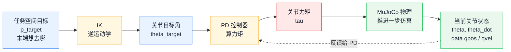

import Figure from '@site/src/components/Figure';

# 3. 逆运动学


正运动学描述的是从关节角到末端位姿的映射：关节角 → 末端。逆运动学解决相反的问题：给定一个末端目标，求出对应的关节角。这一章我们用两种方式实现 IK，并把它接到第 1 章的 PD 控制器上，做出第一个"点到点控制" demo。

## 本章目标

- 理解 IK 的多解性、奇异性、可达性
- 能对 3-DoF 平面臂手推解析解
- 能用雅可比伪逆法 / damped least squares 写数值 IK
- 在 MuJoCo 里让机械臂末端追踪一个移动目标

## 前置阅读

- 第 2 章 [正运动学](/docs/practices/quadruped/cs123/forward-kinematics)
- [ROS · 正逆运动学实现](/docs/foundations/robotics-and-ros2/fk_ik_implementation)
- 交互页：[IK Playground](/cs123/ik-playground)，鼠标拖目标就能看 DLS 的收敛

## 3.1 什么是逆运动学

**正运动学(Forward Kinematics, FK)** 的目标是:给定一组关节角 $\theta = (\theta_1, \ldots, \theta_n)$，求出末端位姿 $p$(位置 + 朝向)。**逆运动学(Inverse Kinematics, IK)** 反过来:给定一个末端目标位姿 $p_\text{target}$，求出一组关节角 $\theta$ 使得 $p(\theta) = p_\text{target}$。

FK 是一个干净的前向函数，IK 则是"解一个非线性方程组"，通常欠定或过定——这正是它比 FK 麻烦的根源。

## 3.2 解析解 vs 数值解

求 IK 的方法可以分两大类:

- **解析解(Analytical / Closed-form)**:把方程组手推到底，直接给出 $\theta$ 的显式表达。**一次到位、不迭代、无误差**，但只对**特定结构**(平面臂、球腕 6-DoF 机械臂等)写得出来。
- **数值解(Numerical / Iterative)**:从一个起始 $\theta_0$ 出发，用雅可比把方程线性化，迭代逼近目标。**阻尼最小二乘(Damped Least Squares, DLS)** 是工业界主力。**通用**——任意结构、任意自由度都能跑，代价是依赖初值、容易卡在局部最优。

经验法则:**有特解就用解析，一般机械臂 / 人形 / 四足都用数值**。下面两节分别展开，3.5 节再回来谈三类绕不开的工程难题。

## 3.3 3-DoF 解析法

先退到最干净的情形——**3-DoF 平面臂**，三节长度 $L_1, L_2, L_3$，关节在 z 轴转。

常见的简化做法是把"末端朝向"也作为输入($\phi = \theta_1+\theta_2+\theta_3$)，这样前两个关节退化成经典的 2-DoF 几何问题，第三个关节由朝向约束直接读出。这个拆解过程如 [图 1](#fig-planar-3dof-ik) 所示。

<Figure
  id="fig-planar-3dof-ik"
  src={require('./figs/planar-3dof-ik.webp').default}
  caption="3-DoF 平面臂解析 IK：先从目标末端位姿沿末端朝向倒退 L3，得到 wrist 点 (x', y')；再把 L1、L2 和 r 看成一个三角形，用余弦定理解出前两个关节。"
  width={620}
/>

令:

$$
x' = X - L_3\cos\phi,\quad y' = Y - L_3\sin\phi,\quad r^2 = x'^2 + y'^2
$$

由余弦定理:

$$
\cos\theta_2 = \frac{r^2 - L_1^2 - L_2^2}{2 L_1 L_2}
$$

- 若 $|\cos\theta_2| > 1$:目标不可达，直接返回"不行"。
- 否则 $\theta_2 = \pm\arccos(\cdot)$——**正负号就是"肘上/肘下"**，一般按期望构型固定选一个。

$\theta_1$ 由"指向 $(x',y')$ 的总角度 − $L_2$ 贡献的那一部分"给出:

$$
\theta_1 = \mathrm{atan2}(y', x') - \mathrm{atan2}(L_2\sin\theta_2,\,L_1 + L_2\cos\theta_2)
$$

$\theta_3$ 由朝向一句话补齐: $\theta_3 = \phi - \theta_1 - \theta_2$。

演示代码如下:

```python title="代码 3-1 3-DoF 平面臂解析 IK"
import numpy as np

def ik_analytic_planar(xy, phi, L=(0.3, 0.25, 0.15), elbow_up=True):
    X, Y = xy
    L1, L2, L3 = L

    xp = X - L3 * np.cos(phi)
    yp = Y - L3 * np.sin(phi)
    r2 = xp * xp + yp * yp

    cos_t2 = (r2 - L1**2 - L2**2) / (2 * L1 * L2)
    if abs(cos_t2) > 1.0:
        return None  # 不可达,调用方要能处理 None

    t2 = np.arccos(cos_t2) * (1.0 if elbow_up else -1.0)
    t1 = np.arctan2(yp, xp) - np.arctan2(L2 * np.sin(t2), L1 + L2 * np.cos(t2))
    t3 = phi - t1 - t2
    return np.array([t1, t2, t3])
```

解析解的价值不是"省 CPU"，而是**做数值解的参考答案**:下一节的数值 IK 跑完后，在平面工况下和解析解比一下，能第一时间抓到"我的雅可比写错了"这类 bug。

## 3.4 DLS 数值法

一旦到 6-DoF 一般机械臂、人形机器人，解析解要么不存在、要么写出来比数值法还长。业内的通用解法是**迭代线性化 + 最小二乘**。

从当前构型 $\theta$ 出发，线性近似一步:

$$
e = p_\text{target} - p(\theta),\qquad \Delta p \approx J(\theta)\,\Delta\theta
$$

最朴素的"雅可比伪逆法"是直接 $\Delta\theta = J^+\, e$，但这在**奇异附近**会炸——$J$ 某个奇异值趋近 0，伪逆对应的那一行会放大到几百几千。

**阻尼最小二乘(DLS)** 把它改造成一个带正则的最小二乘:

$$
\min_{\Delta\theta}\ \|J\Delta\theta - e\|^2 + \lambda^2\|\Delta\theta\|^2
$$

闭式解:

$$
\Delta\theta = J^\top (J J^\top + \lambda^2 I)^{-1}\,e
$$

$\lambda$ 相当于给"往哪个方向动得最多"加了一个代价:远离奇异时和伪逆几乎一致，奇异附近 $\lambda^2 I$ 保住了矩阵的可逆性——不再"瞬间飞出去"。

演示代码如下:

```python title="代码 3-2 阻尼最小二乘数值 IK"
def ik_dls(fk_fn, jac_fn, theta0, p_target,
           lam=0.05, step=0.3, tol=1e-4, max_iter=200):
    # 从初始关节角开始迭代；copy 避免改动调用方传进来的 theta0。
    theta = theta0.copy()
    for k in range(max_iter):
        # 用当前关节角做一次 FK，得到当前末端位置。
        p = fk_fn(theta)

        # 末端误差：希望末端从当前位置 p 走到目标 p_target。
        e = p_target - p
        if np.linalg.norm(e) < tol:
            return theta, k

        # 雅可比把“小的关节角变化 dtheta”线性映射成“小的末端位移 dp”。
        J = jac_fn(theta)                          # (3, n) 或 (6, n)

        # DLS 使用 J^T (J J^T + lambda^2 I)^(-1) e。
        # lambda^2 I 是阻尼项，用来避免奇异附近矩阵病态。
        JJt = J @ J.T
        dtheta = J.T @ np.linalg.solve(
            JJt + (lam ** 2) * np.eye(JJt.shape[0]), e)

        # step 是外层步长，防止一次更新太猛导致震荡或越走越远。
        theta = theta + step * dtheta
    return theta, max_iter                         # 没收敛也要返回,调用方决定怎么办
```

几个**调试时会反复遇到的现象**:

- `step` 取 1.0 很容易震荡、越走越远:减到 0.2~0.3 往往就稳了。
- `lam = 0` 效果最"贪心"，但一进奇异就蹦;`lam` 太大则慢到收敛不动——经验值 0.01~0.1。
- 迭代 500 次还没收敛，往往不是数值问题，而是**目标本来就不可达**。

## 3.5 三个难题

不论用解析还是数值，在 MuJoCo / Isaac Sim 这类仿真器或真机上写 IK，总会反复撞上同样的三类问题。**这三件事就是第 3 章真正的难点**——算法本身只是骨架，工程上能不能用，看的是这三个坑怎么填。

### 3.5.1 多解性

**多解性(Multiple Solutions)** 指的是:到达同一个目标点，机械臂常常有不止一组关节角——平面 2-DoF 臂对应"肘朝上 / 肘朝下"两组，一般 6-DoF 机械臂经常有 8 组甚至 16 组。**选哪组不是数学问题，而是工程约束**——自碰撞、关节限位、能量最小、上一步最近。

最常见的工程做法:

- **热启动**:把上一步的 $\theta$ 作为下一步 IK 的初值，数值法会自然收敛到"离当前最近"那一支，避免肘上 / 肘下来回跳。
- **多 seed 并行**:MoveIt2、TRAC-IK 等框架会同时从若干随机初值跑，再按代价(避碰、能量)挑一个最优。
- **解析法显式选支**:像 3.3 节那样，直接用一个 `elbow_up` 布尔位钉死构型。

### 3.5.2 奇异状态

**奇异状态(Singularity)** 指的是:当机械臂完全伸直、或几个关节轴线重合时，**雅可比矩阵退化**——$\det(JJ^\top)\to 0$，纯伪逆 $J^+$ 的某些元素 $\to \infty$。后果是:计算出的关节速度指令瞬间飙到机械极限之外。

几何上，这对应"机械臂瞬间少了一个自由度":6-DoF 机械臂第 2、3 关节共线时，腕关节的某些方向再怎么转，末端也出不去。

三种处理思路，从软到硬:

1. **DLS 阻尼**(3.4 节的默认做法):用 $\lambda^2 I$ 把奇异值"垫起来"，最常用、性价比最高。
2. **奇异值截断 (Truncated SVD)**:把小于阈值的奇异值强行置 0，等价于放弃那个方向的修正。
3. **路径规划层面绕开**:把奇异区在工作空间里框出来，IK 之前就不让目标落进去。

实战上，**DLS + 关节限位 + 起步 seed 多样化**是性价比最高的组合。

### 3.5.3 不可达性

**不可达性(Reachability)** 指的是:目标点超出机械臂物理长度范围，数学上方程组**无解**——这正是第 2 章那张"甜甜圈"图之所以重要的原因。严肃的 IK 实现会先做一次"目标是否可达"的保护，再进迭代。

还有一种更隐蔽的"可达但到不了":目标在工作空间里，但当前构型被关节限位、自碰撞或环境障碍物挡住，数值法只能收敛到一个局部最优。这时单跑一次 IK 注定失败，需要靠 3.5.1 提到的多 seed 或显式路径规划绕过去。

DLS 在这两类情形下都不会崩——它会"贴着边缘最近点"跟着目标走(3.9 节会直观看到这一点)，这是它相对纯伪逆最大的工程优势。

## 3.6 IK + PD 控制

IK 给出的是**关节目标角**，不是力矩。把它喂进第 1 章那条 PD 回路，就构成了机器人学里最基础的 **Task-space → Joint-space → Torque** 三层串联：



上面这条实线是**命令链路**：末端目标先被 IK 换成关节目标角，再由 PD 换成力矩。下面这条虚线是**反馈链路**：MuJoCo 每一步都会给出当前关节角和关节速度，PD 用它们计算误差并修正下一次力矩。

### 3.6.1 MuJoCo FK / 雅可比

3.4 节的 `ik_dls` 留了两个口子——`fk_fn` 和 `jac_fn`，这一节先把它们落地。手算雅可比对 3-DoF 平面臂还行，到 6-DoF 真机就非常容易写错；**更靠谱的工程做法是直接让 MuJoCo 替你算**：

```python title="代码 3-3 用 MuJoCo 算 FK 和雅可比"
import mujoco
import numpy as np

model  = mujoco.MjModel.from_xml_path('planar_3dof.xml')
data   = mujoco.MjData(model)
end_id = mujoco.mj_name2id(model, mujoco.mjtObj.mjOBJ_SITE, 'end_site')

def fk_mj(theta):
    data.qpos[:3] = theta
    mujoco.mj_forward(model, data)            # 跑一次正运动学
    return data.site_xpos[end_id, :2].copy()  # 平面臂只取 (x, y)

def jac_mj(theta):
    data.qpos[:3] = theta
    mujoco.mj_forward(model, data)
    jacp = np.zeros((3, model.nv))
    mujoco.mj_jacSite(model, data, jacp, None, end_id)
    return jacp[:2, :3]                       # 平面臂取前 2 行、前 3 列
```

`mj_jacSite` 会按当前 `qpos` 直接把 site 的几何雅可比算出来，省掉所有手推工作；要切换到不同机器人，只要换 XML 和 site 名字。**第 2 章那条"自写 FK vs `mj_forward` 误差 < 1e-12"的校验思路在这里同样适用**：写完手算的 `jac_fn` 后，跟 `jac_mj` 在同一组 $\theta$ 上比一下，能在 5 分钟内抓到 99% 的链式乘法 bug。

### 3.6.2 最小控制循环

把上面的 `fk_mj` / `jac_mj` 接进 PD：

```python title="代码 3-4 IK + PD 最小控制循环"
# 这里的机械臂有 3 个旋转关节，所以 Kp/Kd 都写成长度为 3 的数组。
# 第 i 个元素就是第 i 个关节自己的 PD 增益，而不是末端 x/y/z 三个方向的增益。
# 第 3 个关节通常更轻、更短，所以这里给它更小的增益，避免力矩过硬导致抖动。
Kp = np.array([40.0, 40.0, 20.0])
Kd = np.array([ 4.0,  4.0,  2.0])

# theta 保存 IK 求出来的“目标关节角”。
# 初始值用零位；后面每一轮都会把上一轮结果继续传给 ik_dls，作为热启动。
theta = np.zeros(3)                          # IK 的热启动值
for _ in range(5000):
    # 任务空间目标：希望末端到达平面坐标 (0.4, 0.1)。
    # 注意这里是末端位置目标，不是关节角目标。
    p_target = np.array([0.4, 0.1])          # 或者第 3.7 节里让它画圆

    # IK 层：把末端目标 p_target 转成 3 个目标关节角 theta。
    # fk_mj/jac_mj 分别由 MuJoCo 提供当前模型的 FK 和雅可比。
    # 返回的 theta 只是“应该去哪里”，还不是直接施加到电机上的力矩。
    theta, _ = ik_dls(fk_mj, jac_mj, theta, p_target)   # 直接传 MuJoCo 版本

    # 读取仿真器里的当前关节状态。
    # q  是当前 3 个关节角，dq 是当前 3 个关节速度。
    q, dq = data.qpos[:3], data.qvel[:3]

    # PD 层：把“目标关节角 theta”和“当前关节角 q”的误差变成关节力矩。
    # Kp * (theta - q) 是位置误差项，让关节往目标角度靠近。
    # Kd * (-dq) 是阻尼项；目标速度默认为 0，所以速度误差是 0 - dq。
    # NumPy 会逐关节相乘，最后得到 3 个力矩，分别写入 3 个 actuator。
    data.ctrl[:3] = Kp * (theta - q) + Kd * (-dq)

    # MuJoCo 用这 3 个力矩推进一步物理仿真，更新下一轮会读到的 q/dq。
    mujoco.mj_step(model, data)
```

**两条别忽略的工程点**:

1. 把上一步的 `theta` 作为下一步 IK 的热启动——DLS 是局部方法，起点离得越近迭代越少、越不容易跳到"肘上/肘下"的另一解。
2. IK 的频率可以**低于** PD。典型值 IK 200 Hz、PD 1 kHz，这也是真机上大多数控制栈的默认配置。

:::tip[想立刻看效果?]
不想装 MuJoCo 可以打开 [IK Playground](/cs123/ik-playground)，鼠标拖目标就能看 DLS 的收敛过程——尤其是拖到机械臂"伸直"那条奇异线附近，能直观感受 $\lambda$ 在做什么。页面里跑的就是上面这个 `ik_dls`，只是搬到浏览器里、不挂物理引擎。
:::

## 3.7 实验：末端画圆

用一个参数化目标轨迹，就能看到 IK + PD 是不是真的"连成一条线"：

```python title="代码 3-5 末端画圆轨迹跟踪"
import numpy as np

center = np.array([0.45, 0.0])
R, T = 0.08, 4.0     # 半径 8 cm,周期 4 s

traj_log = []
while data.time < 20.0:
    t = data.time
    p_target = center + R * np.array([np.cos(2*np.pi*t/T),
                                       np.sin(2*np.pi*t/T)])
    theta, _ = ik_dls(fk_mj, jac_mj, theta, p_target)

    q, dq = data.qpos[:3], data.qvel[:3]
    data.ctrl[:3] = Kp * (theta - q) + Kd * (-dq)
    mujoco.mj_step(model, data)

    traj_log.append((t, p_target.copy(), data.site_xpos[end_id, :2].copy()))
```

观察重点：

- 圆画得**圆不圆**：不圆往往是 PD 跟不上，加大 $K_p$ 或降低圆速度。
- 半径 $R$ 加大到工作空间边缘时，圆会突然变成一段弧——那是 IK 开始返回 `None`，末端走不出去。
- 圆心 `center` 设到 $(0.8, 0)$ 这种绝对不可达的位置，可以看到 IK 直接退化成"朝目标方向伸直"。DLS 在这里是**优雅失败**，不崩不炸，而是尽力靠近。

把 `traj_log` 里的目标轨迹和实际轨迹画到同一张 matplotlib 图上，肉眼差距就是**控制带宽 + IK 残差**的总和；示例结果如 [图 2](#fig-ik-circle-tracking) 所示。

<div style={{maxWidth: 720, margin: '0 auto'}}>
  <Figure
    id="fig-ik-circle-tracking"
    src={require('./figs/ik-circle-tracking.webp').default}
    caption="IK + PD 末端画圆轨迹跟踪结果。蓝线是期望末端轨迹，红线是 MuJoCo 中实际末端轨迹；两者之间的细小偏差来自 IK 残差和 PD 闭环的跟踪滞后。"
    width="100%"
  />
</div>

## 3.8 实验：末端走三角形

圆是连续可微的轨迹，IK 求解器没什么压力。换成**三角形**——三个角点处目标速度突变——就能把"IK + PD"这一串里每一环的极限暴露出来。

先写一个最小的轨迹生成器，整个三角形周期 $T=3$ s，每条边花 1 s 走完：

```python title="代码 3-6 三角形轨迹生成器"
def interpolate_triangle(t, vertices, period=3.0):
    """3 个顶点循环,每条边走 period/3 秒。返回当前目标点。"""
    seg = (t % period) / (period / 3)         # 0..3,落在哪条边上
    i   = int(seg) % 3                        # 当前边的起点编号
    s   = seg - int(seg)                      # 这条边走了多少 (0..1)
    p0, p1 = vertices[i], vertices[(i + 1) % 3]
    return (1 - s) * p0 + s * p1
```

把它接到 3.6 的控制循环里：

```python title="代码 3-7 三角形轨迹控制循环"
vertices = np.array([
    [0.45,  0.10],
    [0.30, -0.10],
    [0.55, -0.05],
])

while data.time < 15.0:
    p_target = interpolate_triangle(data.time, vertices, period=3.0)
    theta, _ = ik_dls(fk_mj, jac_mj, theta, p_target)

    q, dq = data.qpos[:3], data.qvel[:3]
    data.ctrl[:3] = Kp * (theta - q) + Kd * (-dq)
    mujoco.mj_step(model, data)
```

观察重点：

- **角点会被"圆"掉**：目标速度在角点突变，但关节加速度受 $K_p / K_d$ 限制——三角形的尖角会被磨成弧。这是控制带宽的直接体现，不是 bug。
- **拐角越急、$K_p$ 越大跟得越紧**，但太大会震荡（第 1 章那个老问题）。把 $K_p$ 从 40 调到 80，再调到 200，三种现象会很明显。
- 把三角形某个顶点放到工作空间边缘外，可以看到那一段被"裁短"成一条直冲向最远点的射线——这是 DLS 的**饱和行为**。

三角形轨迹的目标路径与实际末端路径对比如 [图 3](#fig-ik-triangle-tracking) 所示，重点看角点处的圆滑化现象。

<div style={{maxWidth: 720, margin: '0 auto'}}>
  <Figure
    id="fig-ik-triangle-tracking"
    src={require('./figs/ik-triangle-tracking.webp').default}
    caption="IK + PD 末端三角形轨迹跟踪结果。蓝线是分段线性的目标轨迹，红线是实际末端轨迹；角点处被磨圆，说明目标速度突变已经超过当前 PD 增益和机械臂动力学能瞬时跟上的范围。"
    width="100%"
  />
</div>

这一个实验和 3.7 的圆放一起，刚好覆盖了"光滑轨迹 + 不光滑轨迹"两类典型任务，已经足够第 4 章四足步态或第 5 章末端抓取直接复用。

## 3.9 viewer 看 DLS 收敛

光看末端轨迹不够直观——把 <strong>目标点（绿球）</strong> 和 <strong>当前末端（红球）</strong> 都叠到 MuJoCo viewer 里，DLS 的"追"才能一眼看出来。这一段是第 2 章 viewer 实验的直接延伸，最终叠加效果见 [图 4](#fig-ik-viewer-debug-overlay)。

```python title="代码 3-8 viewer 中实时可视化 DLS 收敛"
import mujoco.viewer

with mujoco.viewer.launch_passive(model, data) as v:
    while v.is_running():
        p_target = interpolate_triangle(data.time,
                                        vertices, period=3.0)
        theta, _ = ik_dls(fk_mj, jac_mj, theta, p_target,
                          lam=0.05)

        q, dq = data.qpos[:3], data.qvel[:3]
        data.ctrl[:3] = Kp * (theta - q) + Kd * (-dq)
        mujoco.mj_step(model, data)

        # 叠两个调试小球:绿色目标、红色当前末端
        p_now = data.site_xpos[end_id]
        v.user_scn.ngeom = 0
        for k, (pos, rgba) in enumerate([
            (np.r_[p_target, 0.0], [0.2, 0.9, 0.2, 1]),
            (p_now,                [0.9, 0.2, 0.2, 1]),
        ]):
            mujoco.mjv_initGeom(
                v.user_scn.geoms[k],
                type=mujoco.mjtGeom.mjGEOM_SPHERE,
                size=[0.015, 0, 0], pos=pos,
                mat=np.eye(3).flatten(), rgba=rgba,
            )
        v.user_scn.ngeom = 2
        v.sync()
```

<div style={{maxWidth: 720, margin: '0 auto'}}>
  <Figure
    id="fig-ik-viewer-debug-overlay"
    src={require('./figs/ik-viewer-debug-overlay.webp').default}
    caption="viewer 调试叠加效果的静态复现。绿色点是当前目标，红色点是当前末端，红线是最近一段末端轨迹；两个点之间的距离能直接暴露 DLS 残差和 PD 跟踪滞后。"
    width="100%"
  />
</div>

最适合做这个实验的几组对照：

- **改 `lam`**：从 `0.001` → `0.05` → `0.5`，重点看奇异附近（机械臂接近完全伸直时）。`lam=0.001` 会看到红球瞬间"飞出去"再被拉回；`lam=0.5` 红球追得稳但永远滞后一截；`lam=0.05` 是大多数情况下的甜点。
- **改 `step`**：从 0.1 → 0.3 → 1.0，能直观看到迭代步长怎么换收敛速度和稳定性。
- **拖动目标到工作空间外面**：把 `vertices` 改大或写个鼠标交互，DLS 不会崩，红球会"贴着边缘最近点"跟着走——这就是 DLS 相对纯伪逆最大的工程优势。

这种"绿球 + 红球"叠加调试是真机上排障的标准动作：**末端追不上目标到底是 IK 没收敛，还是 PD 跟不上，看一眼颜色就分得清**。

## 小结

- **IK 是反向问题**：FK 是"关节角 → 末端位姿"的单向函数，IK 是反过来求"末端位姿 → 关节角"。它比 FK 麻烦得多——**多解性**（肘上/肘下）、**奇异状态**（雅可比退化）、**不可达性**（目标在工作空间外或被障碍物挡）三类工程难题都是常态。
- **解析解 vs 数值解**：解析解只能在特例（平面 3-DoF、球腕 6-DoF 等）里写得出来，但价值很高，可以**给数值解当参考答案**抓 bug；一般机械臂、人形机器人都用数值解，**阻尼最小二乘(DLS)** $\Delta\theta = J^\top(JJ^\top + \lambda^2 I)^{-1} e$ 是工业界主力，靠 $\lambda$ 在奇异附近稳住伪逆。
- **雅可比是核心**：数值 IK 的核心是**雅可比矩阵**——它把"关节怎么动"和"末端怎么动"联系起来。手算雅可比容易出错，工程上更常用 MuJoCo 的 `mj_jacSite` 直接拿，并用同样的"和物理引擎对齐"思路做交叉校验。
- **IK + PD 的串联结构**：IK 输出关节目标角，PD 把它变成力矩，构成机器人学最基本的 **Task-space → Joint-space → Torque** 三层级联。两条工程经验：(1) 上一步的 $\theta$ 作为下一步 IK 的热启动，避免跳到另一组解；(2) IK 频率（约 200 Hz）可以低于 PD（约 1 kHz），真机控制栈通常这样配。
- **三个 MuJoCo 实验串起来**：3.7 画圆验证光滑轨迹跟踪、3.8 走三角形暴露角点处的控制带宽、3.9 在 viewer 里用绿球（目标）+ 红球（当前末端）实时观察 DLS 收敛，便于排查"追不上"到底是 IK 还是 PD 的锅。这套调试范式会在第 4 章四足、第 5 章抓取里反复用到。

## 动手任务

§3.8 让平面臂走了个抽象三角形，§3.9 又把绿球（目标）和红球（当前末端）叠到了 viewer 里。本章动手任务把这两件事各往物理意义上推一格：三角形的三个顶点变成 **touchdown / standing / liftoff**，中间补一段 **mid-swing 抛物线**——这就是 **Raibert 三角**，四足所有步态的原子动作。轨迹接到 Ch2 那条 Pupper 真腿（用 `<weld>` 把 hip 挂在空中），DLS IK + Ch1 的 PD 闭环跑起来。Ch5 的 trot 步态就是"这条腿 × 4 + 相位偏移"，提前在这里把原子动作打磨好。

<div align="center">


*Pupper 单腿悬空踏步。前 6 秒是完整的 Raibert 三角：stance 沿 $-x$ 后扫贴地、swing 用抛物线抬起再落下；最后 2 秒做反例段——swing 不抬高，足端像方波切换，同样的 IK + PD 跟踪它就明显失真。绿球是 Raibert 给的目标点，红球是 `fk_leg(q)` 在 IK 解出的关节角处的足端预测，两个球贴得有多紧，DLS 就收得有多干净。*

</div>

要做的四件事：

- [ ] 在 `scene.xml` 加 `<weld body1="hip" body2="world" relpose=...>` 把腿挂起来；写 `raibert_foot_traj(t)` 的 stance / swing 分支和 mid-swing 抛物线
- [ ] DLS 一步迭代：`mj_jacSite` 取 foot 的 $3\times 3$ 平移雅可比 + 阻尼伪逆，50 步内残差 $< 10^{-3}$ m
- [ ] 闭环：每帧 目标 → IK → PD → `mj_step`，viewer 叠绿球 / 红球；连跑 8 秒看 base z 标准差是 0
- [ ] Stretch：`step_length` 从 0 线性扫到 0.12 m，看"原地踏步"渐变成"D 字形迈步"——给 Ch5 trot 留个伏笔

{/* TODO(cs123-labs-migration): 代码迁入本仓库 docs/practices/quadruped/cs123/labs/ 后,补充 GitHub tree URL */}
完整 starter / 测试 / 交付清单见 `labs/lab_3_stepping/`(代码施工中,稍后补充)。

## 参考资料

- CS123 Lab 3 & Lecture 4（IK 章节）
- Buss, "Introduction to Inverse Kinematics with Jacobian Transpose, Pseudoinverse and Damped Least Squares methods"
